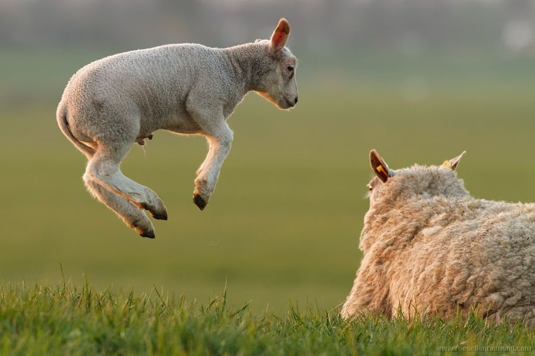

class: inverse, center, middle
background-image: url("")
background-size: cover
# R Markdown Workshop

### USING XARINGAN
.large[Zhi Yang | RStudio Conference | 15 Jan 2019]

---
layout: true
background-image: url(https://www.rstudio.com/wp-content/uploads/2018/10/RStudio-Logo-Flat.png)
background-position: 5% 95%
background-size: 10%

---
class: left 
name: begin

# Introduce yourself!
<!-- edit name1 and name2 in the YAML above -->

```{r setup, include=FALSE}
options(htmltools.dir.version = FALSE)
knitr::opts_chunk$set(warning = FALSE, message = FALSE)
options(knitr.table.format = "html")
knitr::opts_chunk$set(fig.retina = 3)
library(tidyverse) # load tidyverse package
library(babynames) # load babynames package
#library(leaflet) # uncomment to use if you install
```

```{r eval = FALSE}
# optional package installs if you want to do more below
install.packages("leaflet")
```

<!-- introduce yourself here  Hello my name is `r rmarkdown::metadata$author`!
-->

Hello my name is Zhi!

I am a PhD student in biostatistics at USC and my favorite R package is rjags, .left[and a baby rabbit, fluffy]

<!-- include an image here, if you have a GitHub account use your profile pic! -->

```{r photo, echo = FALSE, eval=FALSE}
knitr::include_graphics("https://github.com/zhiiiyang.png") # update USERNAME here
```


???
This is the notes that I can only see 

---
<!-- we make the data here -->

```{r filterdata}
# getting the data
namedata <- babynames %>%
  filter(name == params$name1 | 
           name == params$name2) %>% 
  filter(sex == "F") #<<

head(namedata) %>% 
  knitr::kable()
```

---
<!-- get and see top years for each name -->

```{r gettopyears}
topyears <- namedata %>% 
  group_by(name) %>% 
  top_n(1, prop) 
```

---

```{r topyear-name1 , highlight.output=3:4}
topyears %>% 
  filter(name == params$name1) 
```


```{r topyear-name2}
topyears %>% 
  filter(name == params$name2)
```


---
<!-- plot name popularity over time -->
.pull-left[
```{r plot-last, fig.show = 'hide'}
ggplot(namedata, 
  aes(x = year, 
      y = prop,  
      group = name, 
      color = name)) + 
  geom_line() 
```
]

--
.pull-right[
```{r ref.label = 'plot-last', echo = FALSE}
```
]

---

.pull-left[
```{r plot-first, echo = FALSE}
ggplot(namedata, 
  aes(x = year, 
      y = prop,  
      group = name, 
      color = name)) + 
  geom_line() 
```
]
--
.pull-right[
```{r ref.label = 'plot-first', eval = FALSE}
```
]

---
<!-- where are you from? -->


```{r}
# erase this chunk option if you want to include a map
library(leaflet)
leaflet() %>% addTiles() %>% setView(lat = 30.2621, lng = -97.7382, zoom = 17)
```

---
class: inverse, center, middle

background-image: url("img/capebara.jpg")
background-position: 0% 0%
background-size: 100%

I add a new picture!

---

```{r}
# url
 
```

